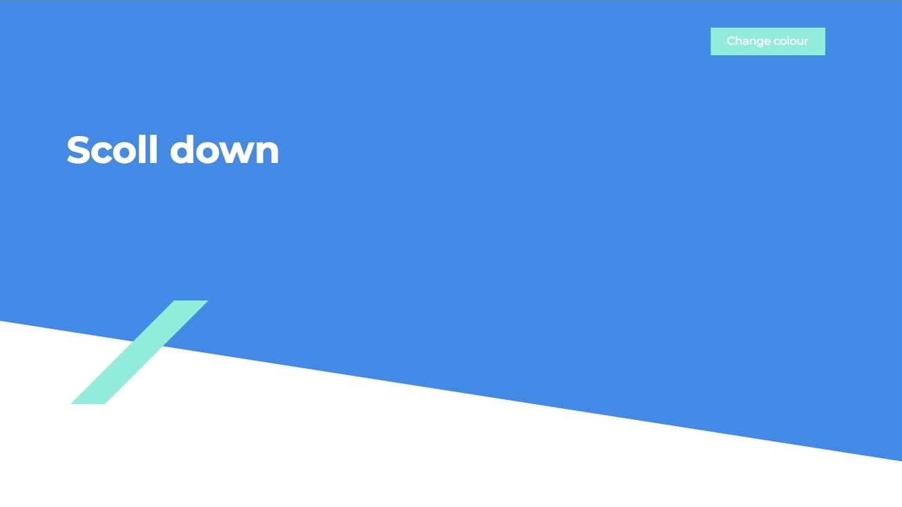

# Rotating-Div-page-when-scrolling-down
One page has a div that rotates while scrolling down.

You can switchover between background colour and main colour by clicking the 'Change colour' button.

This is a responsive one page template using HTML, CSS, Javascript, Bootstrap 4

